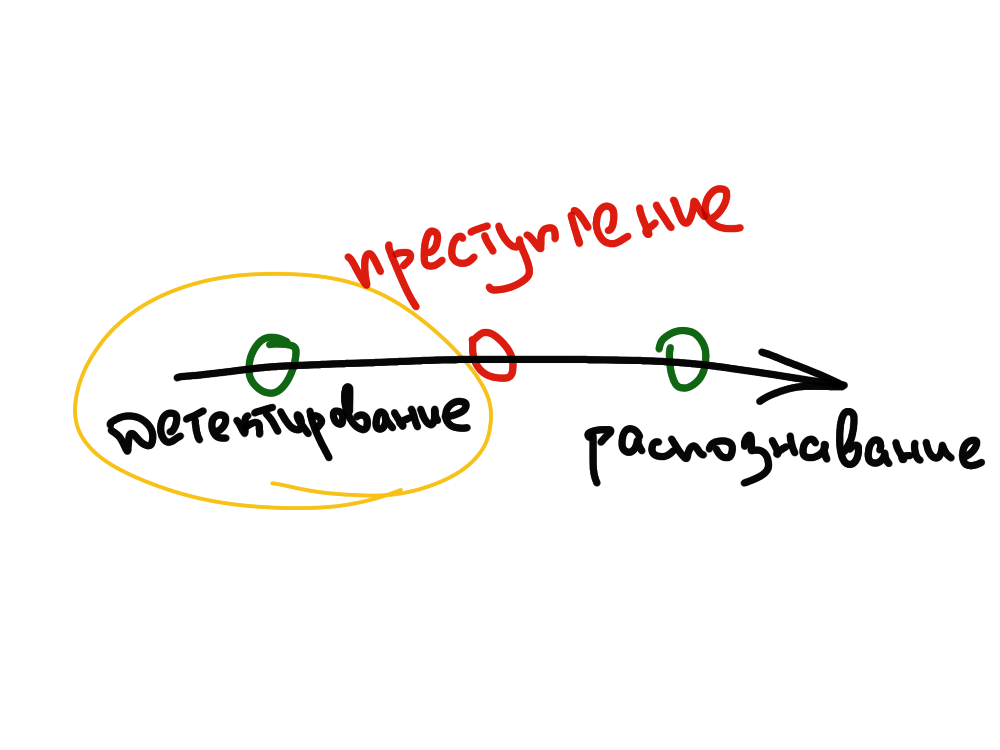
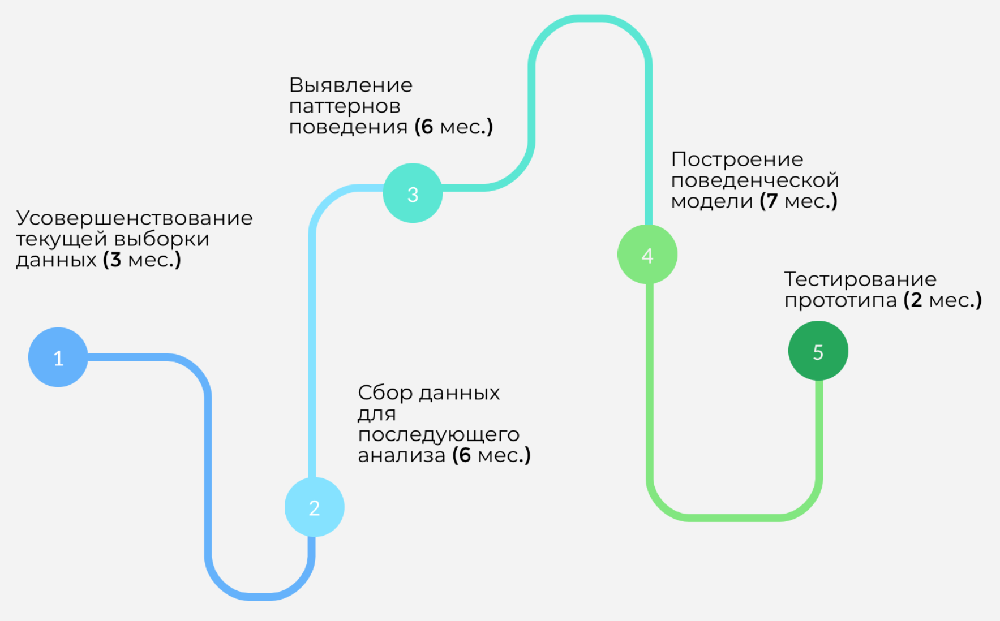

## Описание проблемы

- Задержка реагирования (перефразировать)
- Сложно за всем уследить (перефарзировать)
- 

## Примеры успешного внедрения машинного обучения

### Система фиксации нарушений ПДД по видеоизображению
### Система отслеживания нарушений правил безопасности с помощью видеоаналитики
### Автоматическое обнаружение видимых дефектов на выпускаемой продукции
### Интеллектуальное управление дорожным движением

::: notes

* Ольвия, ООО "Технологии распознавания"
* Центр2М
* Do not know
* axxonsoft
:::

## Имеющиеся решения

### Подходы

* Предсказание ключевых точек
* Поиск Haar-подобных характеристик
* HOG + Adaboost классификатор

###

###

###

## Разрабатываемый подход

### Принцип действия

* Поиск лица
* Поиск частей лица
* Вывод о состоянии лица (перефразировать. Открытое/Закрытое)

### Для поиска лица и частей лица используются сверточные нейронные сети
### Вывод о закрытости лица основывается на найденных частях лица

## Результаты работы

### 

###

###

* Точность 83.42% 
* Ресурсоэффективный алгоритм
* Запущен на тестовом стенде

## Недостатки метода

### Закрытое лицо не всегда преступное

### Результат детектирования зависит от размеров лица

###

## Поведенческая модель

* Что это такое
* Как это
* Что необходимо

## Возможные области применения 

* Отделения банков
* Транспортные хабы
* Общедоступные гос. учреждения
* Стадионы
* Места проведения массовых мероприятий

## План действий

### 

# 
- E-mail: arseny.zorin@spbpu.com
- GitHub: https://github.com/ArsenyZorin
- GitLab: https://gitlab.com/ArsenyZorin

