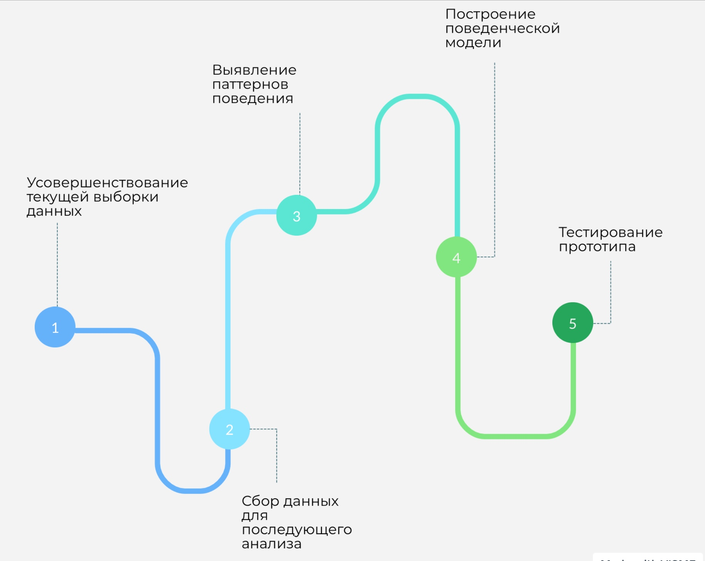

## Описание проблемы

- Высокие затраты при масштабировании
- Человеческий фактор 

## Примеры успешного внедрения машинного обучения

### 
Система фиксации нарушений ПДД по видеоизображению

### 

Система отслеживания нарушений правил безопасности с помощью видеоаналитики

###

Автоматическое обнаружение видимых дефектов на выпускаемой продукции

###

Интеллектуальное управление дорожным движением

::: notes

* Ольвия, ООО "Технологии распознавания"
* Центр2М
* Do not know
* axxonsoft
:::

## Имеющиеся на рынке решения

### Подходы

* Предсказание ключевых точек
* Поиск Haar-подобных характеристик
* HOG + Adaboost классификатор

###

###

###

## Предлагаемый подход

### Принцип действия

* Поиск лица
* Поиск частей лица
* Классификация лица (открытое/закрытое)

### Для поиска лица и частей лица используются сверточные нейронные сети
### Вывод о закрытости лица основывается на найденных частях лица

## Результаты работы

### 

###

###

* Точность 83.42% 
* Ресурсоэффективный алгоритм
* Запущен на тестовом стенде

## Недостатки метода

### Закрытое лицо не всегда преступное

### Результат детектирования зависит от размеров лица

###

## Поведенческая модель

### Принцип работы

Сравнение выполняемых человеком действий со стандартными в данной ситуацией

###

Для построения поведенческой модели необходим анализ большого количества данных

## Возможные области применения 

* Отделения банков
* Транспортные хабы
* Общедоступные гос. учреждения
* Стадионы
* Места проведения массовых мероприятий

## План действий

### 

## Итоги

Имеющиеся результаты:

* Детектор закрытых лиц, использующий сверточные нейронные сети

Задел на будущее:

* Имплементация модели девиантного поведения

# 
- E-mail: arseny.zorin@spbpu.com
- GitHub: https://github.com/ArsenyZorin
- GitLab: https://gitlab.com/ArsenyZorin

